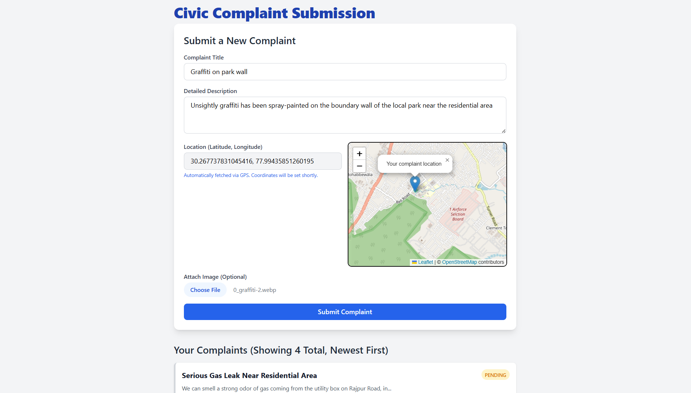
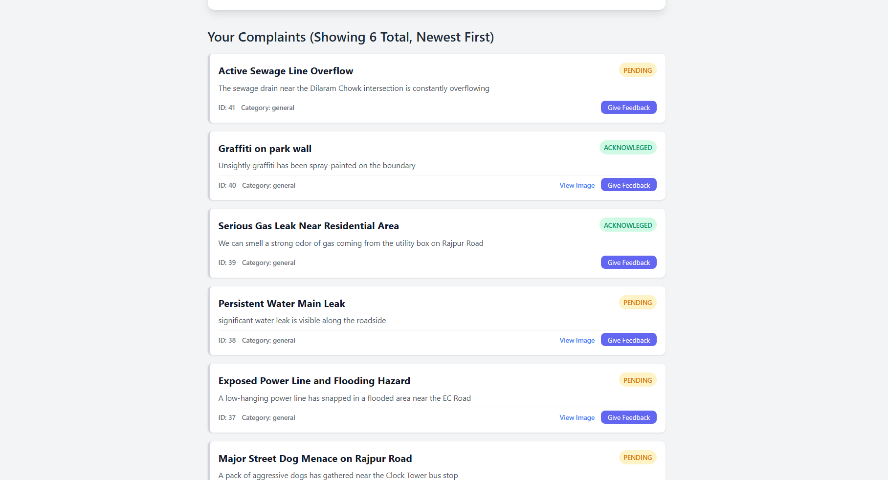
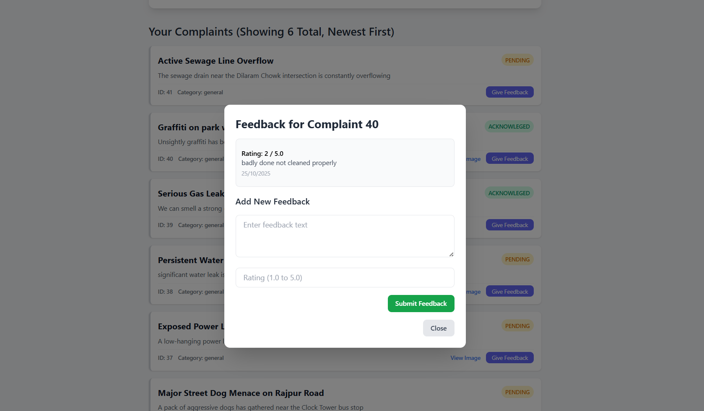
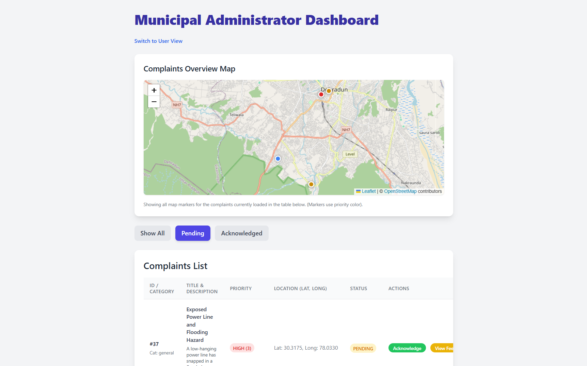
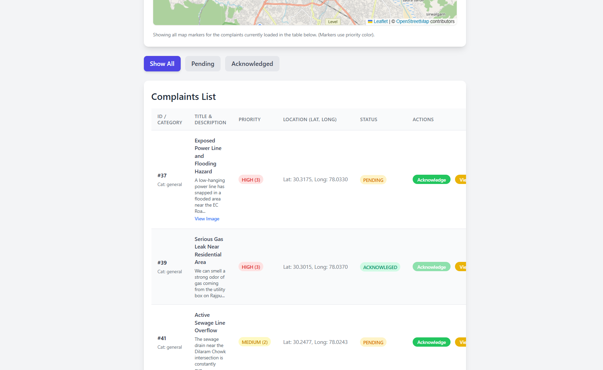
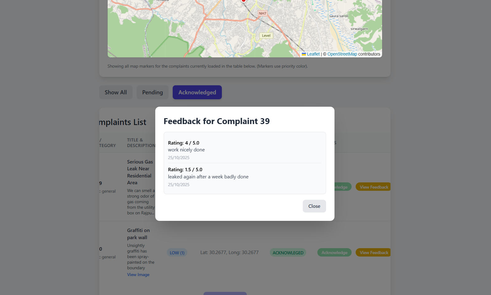
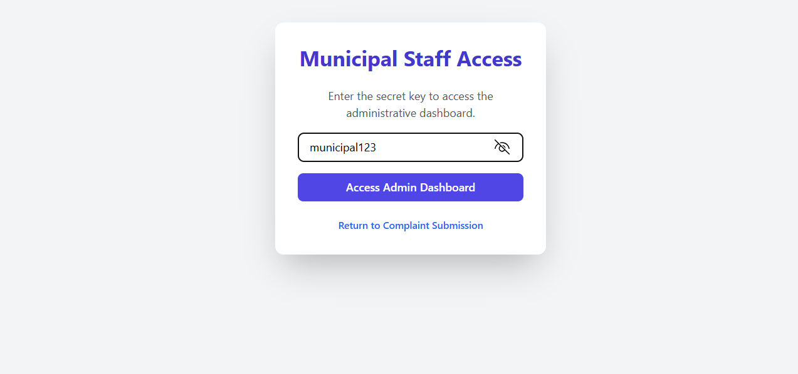

# Civic Complaint Portal

A **full-stack web application** designed to streamline civic issue reporting and management.  
This portal allows public users to submit complaints (which are **automatically categorized by an ML-driven engine**) and provides a **dedicated dashboard** for municipal staff to manage, track, and act on these issues according to Priority.

This project demonstrates a **decoupled architecture**, **CI/CD deployment**, and a **seamless flow of data** from a static frontend, through a Node.js backend, to a Python microservice, and into a persistent PostgreSQL database.

---

## Live Deployments

- **Frontend (Vercel):** [https://civic-project-seven.vercel.app](https://civic-project-seven.vercel.app)
- **Backend API (Render):** [https://civic-backend-api.onrender.com](https://civic-backend-api.onrender.com)  
- **ML Service (Render):** [https://civic-ml-service.onrender.com/predict](https://civic-ml-service.onrender.com/predict)
- use Backend API with API calls mentioned below

---

## Project Showcase

### User Complaint Form  




### Admin Dashboard




### Admin Dashboard 


---

## Core Features

### Public User Portal

- **Submit Complaints:**  
  Clean interface to submit a new complaint with title, description, and optional image upload.  

- **Automatic GPS Location:**  
  Automatically fetches and tags the complaint with the user's current coordinates using the browser’s Geolocation API.  

- **Submit Feedback:**  
  Users can rate and leave text feedback (1–5) on their complaints.  

---

### Municipal Admin Dashboard

- **Secure Access:**  
  Protected by a secret key “Admin Gate.”  

- **Interactive Map View:**  
  All complaints plotted on an interactive **Leaflet** map.  

- **Priority-Colored Markers:**  
  Markers are color-coded by urgency (High, Medium, Low).  

- **Cluster Jitter:**  
  Overlapping markers are scattered using a jitter function for better visibility.  

- **Dynamic Filtering & Sorting:**  
  - Sort by **Priority (descending)**  
  - Filter by **Status** (All, Pending, Acknowledged)  
  - Supports **pagination** via “Load Next Page” button  

- **Manage Complaints:**  
  Admins can update complaint status (e.g., mark as "Acknowledged").  

- **View Feedback:**  
  Review all feedback for a particular complaint.  

---

## Tech Stack & Architecture

This project follows a **modern, decoupled architecture** — the frontend, backend, and ML model are separate services communicating via REST APIs.

| **Component** | **Technology** | **Purpose** |
|----------------|----------------|--------------|
| **Frontend** | HTML5, CSS3, Vanilla JS (ES6) | Lightweight, responsive SPA |
| **Styling** | Tailwind CSS (CDN) | Utility-first CSS for rapid UI |
| **Mapping** | Leaflet.js | Interactive map for complaints |
| **Backend API** | Node.js & Express.js | Core REST API handling logic, DB, and ML service communication |
| **Database** | Supabase (PostgreSQL) | Persistent relational storage |
| **Image Storage** | Supabase Storage (Bucket) | Secure handling of user-uploaded images |
| **ML Model** | Python (Flask & scikit-learn) | Assigns automatic complaint category |
| **Frontend Deployment** | Vercel | CI/CD & global CDN for static frontend |
| **Backend Deployment** | Render | Auto-scaling for Node.js API & ML microservice |

---

## System Data Flow

1. User submits a complaint on the **Vercel-hosted frontend**.  
2. The frontend uploads any image to **Supabase Storage**, receiving a URL.  
3. The frontend sends complaint data (text, coordinates, image URL) to the **Render Node.js backend API**.  
4. The **backend** sends the complaint description to the **Python microservice** and **Render ML Service**.  
5. The **Python microService** analyzes the text and returns a **priority level (3 = High, 2 = Medium, 1 = Low)**.  
6.  The **Render ML Service** analyzes the description and returns a **Category** based on a **scikit-learn classification pipeline** to predict the Category.
7. The backend saves the complete complaint (with priority and category) in **Supabase (PostgreSQL)**.  
8. The **Admin Dashboard** fetches and displays this organized data from the backend.  

---

## Key Feature: The Priority Engine

A core highlight of this project is its **ML-powered automatic triage system**.

The Node.js backend sends each complaint’s description to a Python microservice that assigns a priority level using keyword analysis and ML sevice that predicts the category  based on a scikit-learn classification pipeline.

---

## API Endpoints

| **Method** | **Endpoint** | **Description** |
|-------------|--------------|-----------------|
| **POST** | `/api/complaints` | Create a new complaint (includes priority calculation). |
| **GET** | `/api/complaints` | Get all complaints. Supports filtering via query params (`?status=`, `?user_id=`, `?page=`, `?limit=`). |
| **PATCH** | `/api/complaints/:id` | Update a complaint's status (e.g., mark as "acknowledged"). |
| **POST** | `/api/upload` | Upload an image to the Supabase bucket. Returns a public URL. |
| **POST** | `/api/feedback` | Submit new feedback (rating & text) for a complaint. |
| **GET** | `/api/feedback/:complaint_id` | Get all feedback for a specific complaint. |

---

## ⚙️ How to Run Locally

### 1️⃣ Clone the Repository
```bash
git clone https://github.com/sahajbeersingh/ciivc-project.git
cd ciivc-project
```

### 2️⃣ Open the Frontend
This project consists of three static files: `index.html`, `style.css`, and `script.js`.

Open `index.html` directly in your browser or use the **Live Server** extension in VS Code.

### 3️⃣ Backend Configuration
The frontend is already configured to connect to the live backend API:  
[https://civic-backend-api.onrender.com](https://civic-backend-api.onrender.com)

No additional setup required.
